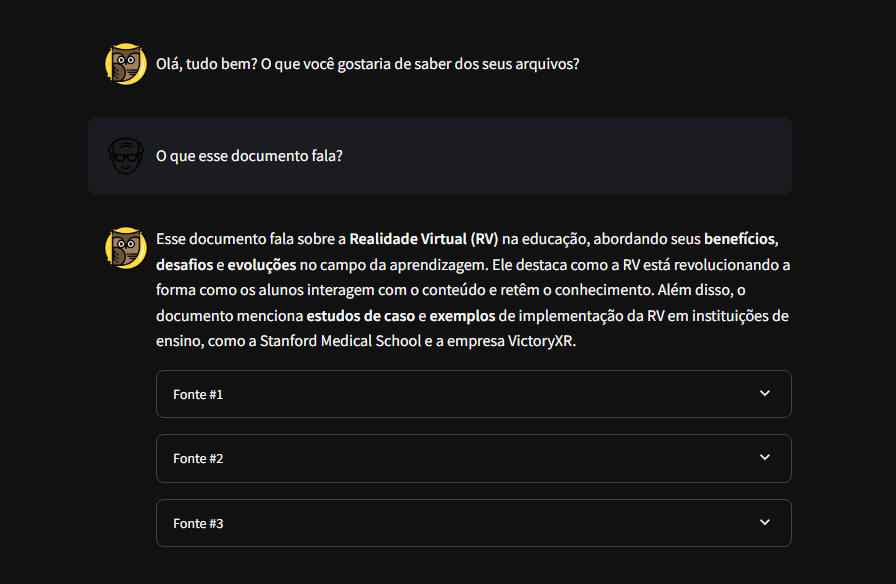
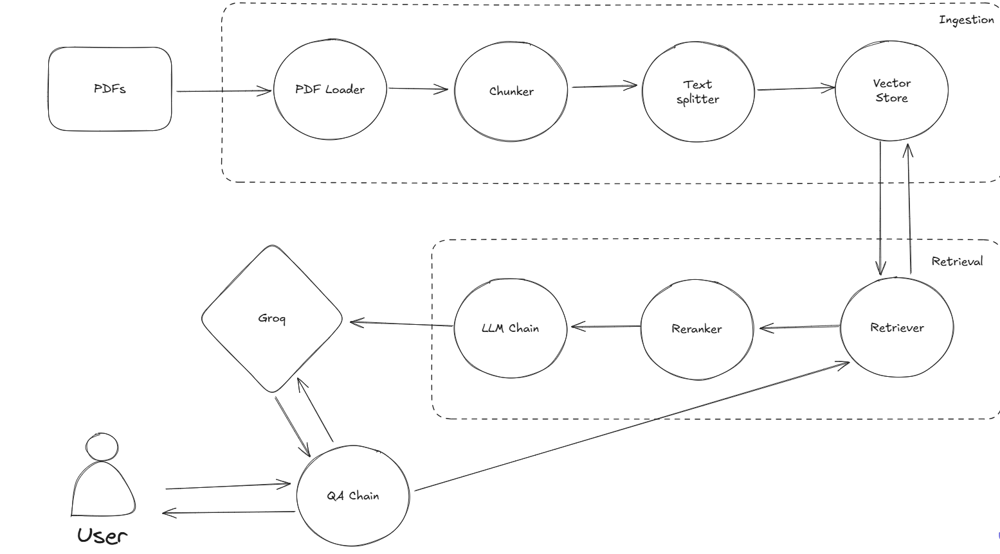

# ChatPDF - Converse com seus PDFs  

Com **ChatPDF**, você pode transformar seus PDFs em assistentes inteligentes, capazes de responder perguntas e interagir com seus documentos de forma eficiente.  

---





## Instalação  

Clone o repositório:  

```bash
git clone 
cd lang-chain-pdf
```  

Instale as dependências (necessário ter o **Poetry** instalado):  

```bash
poetry install
```  

Configure o arquivo de ambiente:  

```bash
cp .env.example .env
```  

---

## Configuração da Chave Groq API (Opcional)  

Se preferir usar a **Groq API** em vez de um modelo de linguagem local (**Ollama**), será necessário adicionar a chave de API no arquivo `.env`.  

Exemplo de configuração:  

```env
GROQ_API_KEY="SUA_CHAVE_API"
```  

Além disso, ajuste a variável `use_local` localizada em `utils/config` para definir a tecnologia a ser utilizada:  

- **`use_local = "on"`**: Usa o Ollama para executar os modelos de linguagem localmente.  
- **`use_local = "false"`**: Usa a Groq API para inferência.  

Escolha a opção que melhor atende às suas necessidades.  

---

## Configuração para Uso do Ollama  

Caso opte pelo Ollama:  

1. **Baixe o modelo LLM** (gemma2:9b por padrão):  

   ```bash
   ollama pull gemma2:9b
   ```  

2. **Inicie o servidor Ollama**:  

   ```bash
   ollama serve
   ```  

3. **Inicie o projeto**:  
   Você pode escolher uma das opções abaixo:  

   ```bash
   poetry run streamlit run app.py
   ```  

   Ou:  

   ```bash
   task dev run
   ```  

---

## Arquitetura do Sistema  

A arquitetura do sistema é composta por três componentes principais:  

1. **Ingestor**:  
   - Extrai textos de documentos PDF.  
   - Divide o texto em blocos (**chunks**) usando divisores semânticos ou baseados em caracteres.  
   - Armazena esses blocos em um banco de dados vetorial para futuras consultas.  

2. **Retriever**:  
   - Recebe a consulta do usuário.  
   - Busca documentos semelhantes no banco de vetores.  
   - Reranqueia os resultados com o **FlashRank**.  
   - Aplica um filtro adicional usando o modelo de linguagem antes de retornar a resposta final.  

3. **QA Chain**:  
   - Integra o modelo de linguagem com o componente retriever.  
   - Gera respostas claras e precisas com base nas informações extraídas.  

### Diagrama da Arquitetura  

  

---

## Tecnologias Utilizadas  

- **[Ollama](https://ollama.com/)**: Plataforma para execução de modelos de linguagem localmente.  
- **[Groq API](https://groq.com/)**: API para inferência eficiente de modelos de linguagem.  
- **[LangChain](https://www.langchain.com/)**: Framework para criação de aplicativos baseados em LLM.  
- **[Qdrant](https://qdrant.tech/)**: Banco de dados vetorial para busca otimizada.  
- **[FlashRank](https://github.com/PrithivirajDamodaran/FlashRank)**: Ferramenta para reranqueamento rápido.  
- **[FastEmbed](https://qdrant.github.io/fastembed/)**: Geração leve e rápida de embeddings.  
- **[Streamlit](https://streamlit.io/)**: Ferramenta para criação de interfaces gráficas de aplicativos.  
- **[PDFium](https://pdfium.googlesource.com/pdfium/)**: Biblioteca para processamento e extração de texto de PDFs.  
- **[Taskipy](https://github.com/taskipy/taskipy)**: Ferramenta que facilita a execução de tarefas em projetos Python.

---

## Fluxo Geral do Sistema  

1. **Ingestão (Ingestion)**:  
   - Os PDFs são processados pelo **PDF Loader** para extrair textos.  
   - O texto é dividido em partes menores (**chunks**) usando um **Chunker** e processado por um **Text Splitter**.  
   - Esses chunks são armazenados no **Vector Store**, utilizando embeddings para buscas futuras.  

2. **Recuperação (Retrieval)**:  
   - O **Retriever** realiza buscas no **Vector Store** com base na consulta do usuário.  
   - Os resultados são reranqueados pelo **FlashRank** e, em seguida, processados pelo modelo de linguagem.  

3. **Geração de Respostas (QA Chain)**:  
   - Combina os dados armazenados e a consulta do usuário para gerar uma resposta precisa.  

4. **Interação Final**:  
   - O usuário interage diretamente com o sistema, realizando perguntas ou buscas, e recebe as respostas otimizadas.  
